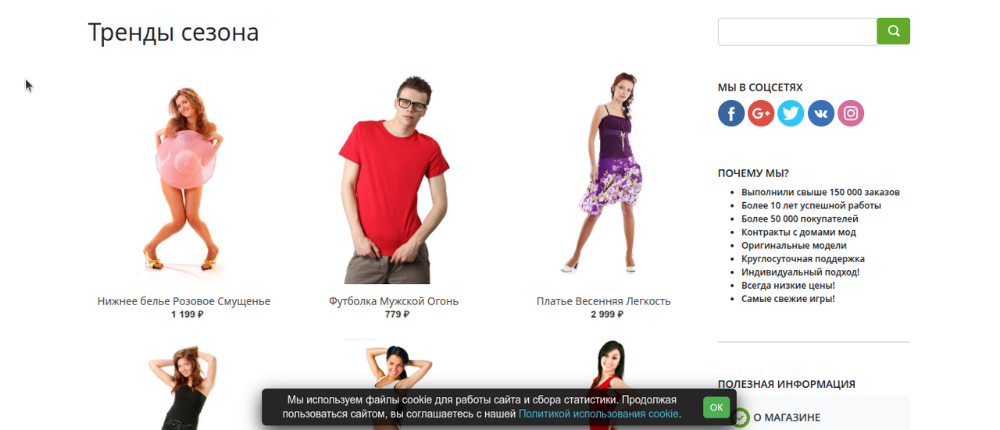
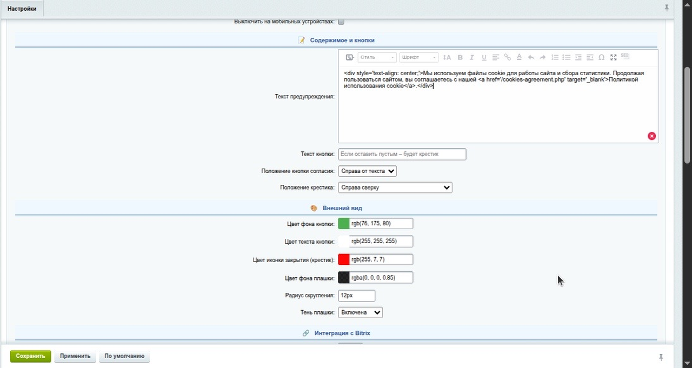

<!--
<meta property="og:image" content="docs/assets/logo.png">
<meta property="og:image:width" content="1280">
<meta property="og:image:height" content="640">
<meta property="og:title" content="ushakov.cookie — модуль плашки согласия на cookie для 1С-Битрикс">
<meta property="og:description" content="Гибкая и легкая плашка согласия на использование cookie для 1С-Битрикс с полной кастомизацией и интеграцией с реестром согласий">
-->

# ushakov.cookie — модуль плашки согласия на cookie для 1С-Битрикс

[](../../releases)
[](LICENSE)


[](../../issues)

Гибкая и легкая плашка согласия на использование cookie для **1С-Битрикс**:

- позиция и выравнивание,
- цвета кнопки и крестика,
- задержка показа,
- хранение согласия (сессионно / N дней),
- интеграция с **Реестром согласий Битрикс** (опционально).

## 📸 Скриншоты

### Основной интерфейс


### Мобильная версия


### Панель настроек


---

## ✨ Возможности

- Позиция плашки: **верх / низ**, выравнивание: **слева / центр / справа**
- **Кнопка согласия** и **крестик**: настройка положения и цветов
- Задержка показа, ширина, отступы, скругление, тень, `z-index`
- Хранение согласия: **сессия** или **N дней** (через cookie с параметрами `SameSite=Lax`, `Secure` при HTTPS)
- (Опционально) запись факта согласия в **Реестр согласий** 1С-Битрикс
- Мультисайтовость: отдельные настройки на каждый сайт
- Текст плашки через визуальный редактор, автоматическая ссылка на `/cookies-agreement.php`
- **Hover-эффекты**: автоматическое затемнение цветов кнопок и крестика при наведении
- **Валидация CSS**: проверка корректности значений px, rem, em, % для всех размерных параметров
- **Антидублирование**: предотвращение создания дублирующих записей согласий в реестре
- **Обратная совместимость**: поддержка как новых, так и старых ядер Bitrix (UserConsent API)

---

## ⚙️ Совместимость

- PHP **7.4+ / 8.0+**
- 1С-Битрикс (модуль `main`)
- HTTPS поддерживается; при HTTPS выставляется флаг `secure`

---

## 📦 Установка

### Вариант A — из релиза
1. Скачайте ZIP из раздела **[Releases](../../releases)**.
2. Распакуйте в `/local/modules/` (или `/bitrix/modules/`) так, чтобы получилась папка `/local/modules/ushakov.cookie`.
3. В админке Битрикс: **Marketplace → Установленные решения → Установить модуль**.
4. В мастере установки выберите сайты — **модуль автоматически создаст страницу** `/cookies-agreement.php` в корне каждого выбранного сайта.
   > При удалении модуля эти файлы также будут **автоматически удалены**.

### Вариант B — из GitHub (git)
```bash
cd /path/to/bitrix/local/modules
git clone https://github.com/Dmitrii111111/ushakov.cookie.git ushakov.cookie
```

Затем активируйте модуль в админке; страница `/cookies-agreement.php` будет создана автоматически (см. выше).

---

## 🔧 Настройка


Админка → Настройки → Настройки продукта → Настройки модулей → ushakov.cookie

| Опция | Описание |
|-------|----------|
| Активность | Включить/выключить плашку |
| Позиция/выравнивание | Верх/низ; слева/центр/справа |
| Кнопка согласия | Положение + цвета (фон/текст) |
| Крестик | Положение + цвет |
| Задержка, z-index, отступы | Управление отображением |
| Хранение согласия | Сессия или N дней |
| Текст плашки | HTML/визуальный редактор + ссылка на `/cookies-agreement.php` |
| Реестр согласий | Включить запись и указать ID соглашения |

Пример текста плашки:

```html
Мы используем файлы cookie для работы сайта и сбора статистики.
Продолжая пользоваться сайтом, вы соглашаетесь с нашей
<a href="/cookies-agreement.php" target="_blank" rel="noopener">Политикой использования cookie</a>.
```

---

## 🔧 Технические особенности

### Поддержка старых ядер
Модуль автоматически определяет версию API UserConsent и использует соответствующие классы:
- **Новые ядра**: `\Bitrix\Main\UserConsent\Consent`
- **Старые ядра**: `\Bitrix\UserConsent\Consent`

### Hover-эффекты
Все интерактивные элементы (кнопки, крестик) имеют автоматические hover-эффекты:
- **Кнопка согласия**: затемнение фона на 20% при наведении
- **Крестик**: затемнение цвета на 20% при наведении
- **Поддержка цветов**: RGB, RGBA, HEX, HSL, HSLA с сохранением прозрачности

### Валидация CSS-значений
Модуль проверяет корректность всех CSS-параметров:
- **Размеры**: px, rem, em, % (автоматическая нормализация)
- **Цвета**: проверка форматов и fallback на значения по умолчанию
- **Z-index**: валидация числовых значений

### Антидублирование согласий
Система предотвращает создание дублирующих записей:
- **Проверка по**: ID соглашения + источник + пользователь/IP
- **Логика**: один пользователь = одна запись согласия на соглашение
- **Сессионный флаг**: предотвращение повторного логирования в рамках одной сессии

### Адаптивность и мобильная версия


Модуль автоматически адаптируется под мобильные устройства:
- **Responsive-дизайн**: плашка корректно отображается на всех экранах
- **Touch-friendly**: оптимизировано для сенсорных устройств
- **Опциональное отключение**: можно скрыть на мобильных устройствах

---

## 🧩 Интеграция с Реестром согласий

Если включить опцию, модуль при нажатии «Согласен» добавит запись в Реестр согласий (укажите ID соглашения в настройках).
Для гостей в поле «Пользователь» сохраняется guest или anonymous (в зависимости от конфигурации), для авторизованных — ID пользователя.

---

## 🛡️ Безопасность и приватность

- Куки ставятся с `SameSite=Lax`, флаг `Secure` включается при HTTPS
- HTML плашки пропускается через белый список тегов (минимизация XSS)
- Конфигурация и куки устанавливаются только с текущего домена
- Валидация всех входящих параметров

---

## 🚀 Roadmap

- [x] **Hover-эффекты** с автоматическим затемнением цветов
- [x] **Валидация CSS** для всех параметров
- [x] **Антидублирование** записей согласий
- [x] **Обратная совместимость** со старыми ядрами
- [ ] Кнопка «Отклонить» и/или «Настройки»
- [ ] Доп. триггеры показа (скролл, клик, таймаут)
- [ ] Локализации (EN/DE/RO)
- [ ] Пресеты оформления

---

## 🙌 Вклад

PR и Issues приветствуются: баг-репорты, фич-реквесты, UX-идеи. См. [CONTRIBUTING](CONTRIBUTING.md).

---

## 📜 Лицензия

MIT — см. [LICENSE](LICENSE).

---

---

# English

ushakov.cookie — Cookie consent banner for 1C-Bitrix

Flexible banner for 1C-Bitrix with full customization: position, alignment, button & cross styles, delay, consent storage (session / N days), optional integration with Bitrix Consent Registry.

**Features:**
- Position: top/bottom, alignment: left/center/right
- Button and cross: customizable position and colors
- Delay, z-index, margins, border radius, shadows
- Consent storage: session or N days (cookies with SameSite=Lax, Secure over HTTPS)
- Optional integration with Bitrix Consent Registry
- Multi-site support with per-site settings
- Banner text via visual editor, auto-link to `/cookies-agreement.php`
- **Hover effects**: automatic color darkening for buttons and cross
- **CSS validation**: px, rem, em, % validation for all dimensional parameters
- **Anti-duplication**: prevents duplicate consent records in registry
- **Backward compatibility**: supports both new and old Bitrix cores (UserConsent API)

**Compatibility:**
- PHP 7.4+ / 8.0+
- 1C-Bitrix (main module required)
- HTTPS support with Secure flag

**Installation:**
1. Download ZIP from [Releases](../../releases) and extract to `/local/modules/ushakov.cookie`
2. Install via Bitrix admin: Marketplace → Installed solutions → Install module
3. Select sites during installation — module automatically creates `/cookies-agreement.php` in each selected site root
   > When uninstalling, these files are automatically removed as well.

**Screenshots:**
- Desktop version: [screenshot-desktop.png](docs/assets/screenshot-desktop.png)
- Mobile version: [screenshot-mobile.png](docs/assets/screenshot-mobile.png)  
- Admin panel: [screenshot-admin.png](docs/assets/screenshot-admin.png)

**Settings:**
Admin → Product settings → Module settings → ushakov.cookie.
Options: enable, position/alignment, button and cross, delay/z-index/margins, storage lifetime, banner HTML, (optional) Consent Registry integration.

**Technical features:**
- Automatic detection of UserConsent API version (new/old cores)
- Hover effects with 20% color darkening
- CSS value validation (px, rem, em, %)
- Anti-duplication system for consent records
- Session-based logging prevention

Licensed under [MIT](LICENSE).
